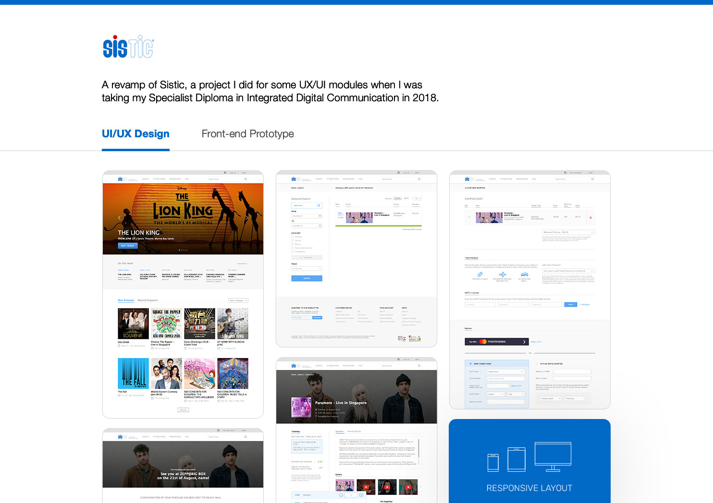

# sistic revamp 2018

This project was done for a UX/UI module in 2018. The main goal was to refurbish Sistic's website UI to improve the user experience & design.

The front-end prototype consists purely of HTML/CSS and abit of jquery.

As time was limited for this module, the only pages that were done up were the home, search (click on the search button) & Paramore concert listing.

[View site prototype](https://harihaysrun.github.io/sistic-2018/)
